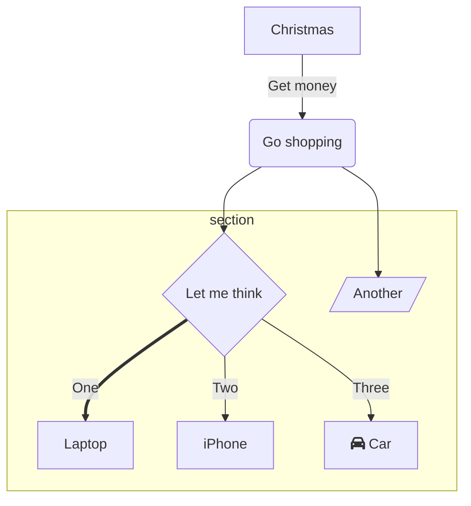

# Usage

一些内置的 markdown 语法和 Vue 组件，你可以直接在 md 文件中使用

## markdown 插件

### step-line

语法：

````md
```stepline
- title: 原始代码
  code: |
    ```ts
    // 定义一个简单的函数，用于计算两个数字的和
    function add(a: number, b: number): number {
        return a + b;
    }
    ```
- title: 转换逻辑
  desc: 直接使用导出的 `codeToHtml` 进行代码转换
  code: |
    ```ts
    import { codeToHtml } from 'shiki'

    const html = await codeToHtml(code, {
      lang: 'javascript',
      theme: 'vitesse-dark'
    })

    console.log(html) // highlighted html string
    ```
```
````

效果：

```stepline
- title: 原始代码
  code: |
    ```ts
    // 定义一个简单的函数，用于计算两个数字的和
    function add(a: number, b: number): number {
        return a + b;
    }
    ```
- title: 转换逻辑
  desc: 直接使用导出的 `codeToHtml` 进行代码转换
  code: |
    ```ts
    import { codeToHtml } from 'shiki'

    const html = await codeToHtml(code, {
      lang: 'javascript',
      theme: 'vitesse-dark'
    })

    console.log(html) // highlighted html string
    ```
```

---

### pm

语法：

````md
:pm-install{"name":"defu", "dev": true}

:pm-install{"name":"defu"}

:pm-run{"script": "dev"}

:pm-x{"command": "giget unjs new-lib"}
````

效果：

:pm-install{"name":"defu", "dev": true}

:pm-install{"name":"defu"}

:pm-run{"script": "dev"}

:pm-x{"command": "giget unjs new-lib"}

---

### mermaid

语法：

````md

````

效果：


---

### file-tree

语法：

````md
```filetree
- dist
  - index.js
  - index.cjs
- src
  - index.js
- .npmignore
- package.json
```
````

效果：

```filetree
- dist
  - index.js
  - index.cjs
- src
  - index.js
- .npmignore
- package.json
```

---

### magic-link

> 引用 github 的用户 id，点击会跳转到对应用户的 github 主页

语法：

````md
{@antfu}
````

效果：

{@antfu}

---

### magic-move

> 在多个代码片段中过渡

语法：

````md
```vue [Options.vue]
<script>
import { defineComponent } from 'vue'

export default defineComponent({
  data: () => ({
    count: 1
  }),
  computed: {
    double() {
      return this.count * 2
    }
  },
})
</script>

<template>
  <p class="greeting">
    {{ count }} * 2 = {{ doubled }}
  </p>
</template>

<style>
.greeting {
  color: red;
  font-weight: bold;
}
</style>
```
```vue [Composition.ts]
<script setup>
import { computed, ref } from 'vue'

const count = ref(1)
const double = computed(() => count.value * 2)
</script>

<template>
  <p class="greeting">
    {{ count }} = {{ doubled / 2 }}
  </p>
</template>

<style>
.greeting {
  color: red;
  font-weight: bold;
}
</style>
```
:::
````

效果：

:::magic-move 
```vue [Options.vue]
<script>
import { defineComponent } from 'vue'

export default defineComponent({
  data: () => ({
    count: 1
  }),
  computed: {
    double() {
      return this.count * 2
    }
  },
})
</script>

<template>
  <p class="greeting">
    {{ count }} * 2 = {{ doubled }}
  </p>
</template>

<style>
.greeting {
  color: red;
  font-weight: bold;
}
</style>
```
```vue [Composition.ts]
<script setup>
import { computed, ref } from 'vue'

const count = ref(1)
const double = computed(() => count.value * 2)
</script>

<template>
  <p class="greeting">
    {{ count }} = {{ doubled / 2 }}
  </p>
</template>

<style>
.greeting {
  color: red;
  font-weight: bold;
}
</style>
```
:::

## Vue 组件

### Code-Editor

> 一个自带预览的可交互的 Vue3 代码编辑器。hash 值可以从编辑完之后，点击右上角的悬浮复制按钮获取

````md
<CodeEditor hash="eNp9U11rE0EU/SvriG/djyS0SIiFpkTRBxUrPu1LmEx3p87OLDOTbLTkyY+qVCoKKlJpEUFEKz6Ivhh/jZvYJ/+Cd/bToHSf7r3n7Jwz997ZRmtx7IyGBLVRR5MoZn1NVn1uWZ0BHVmY9ZU65yNNxtrGhGsifZTBQFCjwBoRqajgQGk4DR/liJXQgQ6h1vI8H1khoUGoIW2atKCMI8bNyaHWcdt1kyRxkpYjZOACy3Ph7JJayIHgKdu25gfv0+mb399300/T4w8vf307OH61N3/wNb13Z/7l0LLtmi4J1pWVhued+dtLkW9SxiA7fX5lzWuuQ8FdlEv37xdyr5/MDnfSp7vp40fpj7sLQphKzIiFx+bcZXNlfCuXgFBCdNYEpVS31+o2mv9KzZ7vzPY/Lkgdvfg5fZa+fZd+3psfPVzQNBMpE+hmpZwJN5eNnuDaVvQ2gcpK3Xj4smn2OQ6FMRfRwYCR2mASUg1pSV/duHGh45pfyrmb4eQr4sKOQGTgYnPQEtIKC75JA2dLCQ5rtW2oPsIiiikj8kqsYWGUj9pWhhisz5hILmU1LYdkqazjkOCb/6lvqbGp+eiqJIrIEditMN2XAdE53Nu4bNpUg5EYDM1dTwCvESXY0HjMad0hh/bA2le8zO3FKBZSUx5cV72xJty8gsqoYU4yvo/gba2fcPXabstpZf/5fIImfwD6EjRD"/>
````

效果：

<CodeEditor hash="eNp9U11rE0EU/SvriG/djyS0SIiFpkTRBxUrPu1LmEx3p87OLDOTbLTkyY+qVCoKKlJpEUFEKz6Ivhh/jZvYJ/+Cd/bToHSf7r3n7Jwz997ZRmtx7IyGBLVRR5MoZn1NVn1uWZ0BHVmY9ZU65yNNxtrGhGsifZTBQFCjwBoRqajgQGk4DR/liJXQgQ6h1vI8H1khoUGoIW2atKCMI8bNyaHWcdt1kyRxkpYjZOACy3Ph7JJayIHgKdu25gfv0+mb399300/T4w8vf307OH61N3/wNb13Z/7l0LLtmi4J1pWVhued+dtLkW9SxiA7fX5lzWuuQ8FdlEv37xdyr5/MDnfSp7vp40fpj7sLQphKzIiFx+bcZXNlfCuXgFBCdNYEpVS31+o2mv9KzZ7vzPY/Lkgdvfg5fZa+fZd+3psfPVzQNBMpE+hmpZwJN5eNnuDaVvQ2gcpK3Xj4smn2OQ6FMRfRwYCR2mASUg1pSV/duHGh45pfyrmb4eQr4sKOQGTgYnPQEtIKC75JA2dLCQ5rtW2oPsIiiikj8kqsYWGUj9pWhhisz5hILmU1LYdkqazjkOCb/6lvqbGp+eiqJIrIEditMN2XAdE53Nu4bNpUg5EYDM1dTwCvESXY0HjMad0hh/bA2le8zO3FKBZSUx5cV72xJty8gsqoYU4yvo/gba2fcPXabstpZf/5fIImfwD6EjRD"/>

---

### Document

> 带有文档 Icon 的链接

````md
<Document link="https://developer.chrome.com/docs/workbox/" name="workbox" />
````

效果：

<Document link="https://developer.chrome.com/docs/workbox/" name="workbox" />

---

### DownloadButton

> 下载按钮

````md
<DownloadButton src="https://peterroe.icu/favicon.ico"/>
````

效果：

<DownloadButton src="https://peterroe.icu/favicon.ico"/>

---

### GitHubLink

> 带有 GitHub Icon 的链接

语法：

````md
<GitHubLink repo="peterroe/un"/>
````

效果：

<GitHubLink repo="peterroe/un"/>

---

### GitHubStar

> 带有 GitHub Icon 的链接

语法：

````md
<GitHubStar repo="peterroe/un"/>
````

效果：

<GitHubStar repo="peterroe/un"/>

### NpmLink

> 带有 npm Icon 的链接

语法：

````md
<NpmLink name="create-un"/>
````

效果：

<NpmLink name="create-un"/>

### PermaLink

> 引用一段 GitHub 的代码

用法

:::code-group
````md
<PermaLink
    id="VITE_PLUGIN_JSON5"
    :omits="[[12, 13], [15]]"
/>
````
```ts [.vitepress/theme/data/permalink.data.ts]
const permaLinkList = [
  // ...
  { // [!code ++]
    id: 'VITE_PLUGIN_JSON5', // [!code ++]
    link: 'https://github.com/timyourivh/vite-plugin-json5/blob/f8243271347c1db91677426cd19313bc511bf72f/src/index.ts#L9-L17', // [!code ++]
  }, // [!code ++]
]
```
:::

效果：

<PermaLink
    id="VITE_PLUGIN_JSON5"
    :omits="[[12, 13], [15]]"
/>

---

### Quote

> 引用一段文字，并显示作者和来源

````md
<Quote author="John Gruber" href="https://twitter.com/gruber">
我知道 HTML，所以在写作上没有问题。我在技术上也没有问题，但最终还是厌倦了，感觉就像是在给自己找麻烦，而且我真的觉得 HTML 让我很难校对我的作品。因此，我所有的校对工作都是在浏览器或文本编辑器内置的HTML渲染器中预览，然后在那里预览。
</Quote>
````

效果：

<Quote author="John Gruber" href="https://twitter.com/gruber">
我知道 HTML，所以在写作上没有问题。我在技术上也没有问题，但最终还是厌倦了，感觉就像是在给自己找麻烦，而且我真的觉得 HTML 让我很难校对我的作品。因此，我所有的校对工作都是在浏览器或文本编辑器内置的HTML渲染器中预览，然后在那里预览。
</Quote>

### TableDemo

> 一个可以展示代码片段和渲染结果的组件

````md
<TableDemo>
<template #fence>

```html
<svg>
  <circle cx="40" cy="40" r="30" fill="#AE9EE8" />
</svg>
```
</template>
<template #play>
<svg>
  <circle cx="40" cy="40" r="30" fill="#AE9EE8" />
</svg>
</template>
</TableDemo>
````

效果：

<TableDemo>
<template #fence>

```html
<svg>
  <circle cx="40" cy="40" r="30" fill="#AE9EE8" />
</svg>
```
</template>
<template #play>
<svg>
  <circle cx="40" cy="40" r="30" fill="#AE9EE8" />
</svg>
</template>
</TableDemo>

### Tweet

> 引用一段推文，暗黑模式支持

语法：

````md
<Tweet>
<p lang="en" dir="ltr">The procrastination in preparing talks drove me to bring up the rework of the idea we had last year with <a href="https://twitter.com/posva?ref_src=twsrc%5Etfw">@posva</a> - animate Shiki tokens like Magic Move! 🪄<br><br>Found a much more reliable approach that could finally come out as a library (soon)<a href="https://t.co/b5SgQtTw2s">https://t.co/b5SgQtTw2s</a> <a href="https://t.co/s5LutlYmAK">pic.twitter.com/s5LutlYmAK</a></p>&mdash; Anthony Fu (@antfu7) <a href="https://twitter.com/antfu7/status/1760751386122211371?ref_src=twsrc%5Etfw">February 22, 2024</a>
</Tweet>
````

效果：

<Tweet>
<p lang="en" dir="ltr">The procrastination in preparing talks drove me to bring up the rework of the idea we had last year with <a href="https://twitter.com/posva?ref_src=twsrc%5Etfw">@posva</a> - animate Shiki tokens like Magic Move! 🪄<br><br>Found a much more reliable approach that could finally come out as a library (soon)<a href="https://t.co/b5SgQtTw2s">https://t.co/b5SgQtTw2s</a> <a href="https://t.co/s5LutlYmAK">pic.twitter.com/s5LutlYmAK</a></p>&mdash; Anthony Fu (@antfu7) <a href="https://twitter.com/antfu7/status/1760751386122211371?ref_src=twsrc%5Etfw">February 22, 2024</a>
</Tweet>

### VImg

> 一个可以展示图片的组件，暗黑模式支持

语法：

````md
<VImg src="https://719283341.r.cdn36.com/peterroe/static-img/master/static/202408200129261.png" />
````

效果：

<VImg src="https://719283341.r.cdn36.com/peterroe/static-img/master/static/202408200129261.png" />

### Youtube

````md
<YouTube v="ZbFKsriOJm0" />
````

效果：

<YouTube v="ZbFKsriOJm0" />
