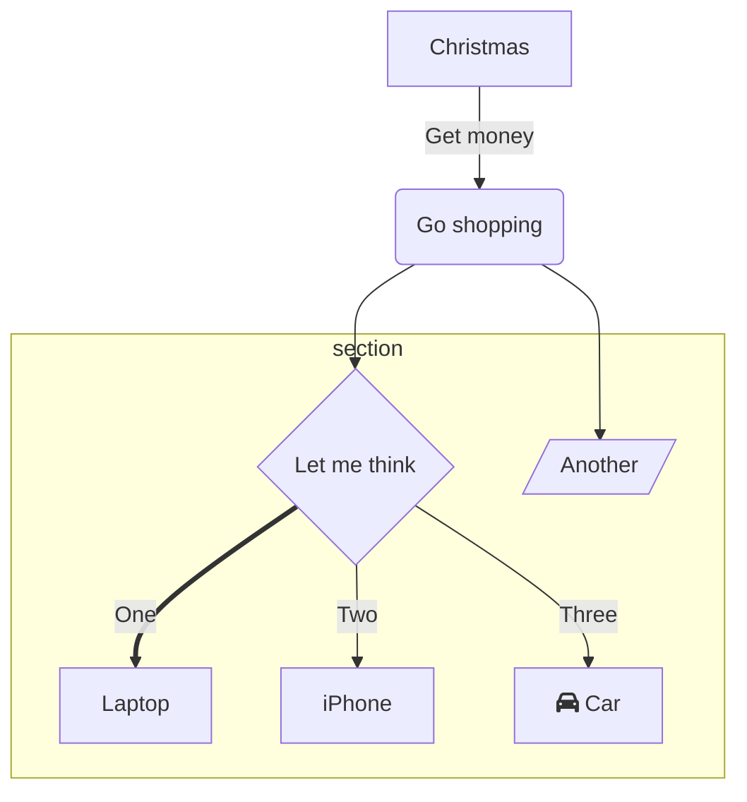

# Usage

Some built-in markdown syntax and Vue components, you can use them directly in md files

## markdown plugins

### step-line

Syntax:

````md
```stepline
- title: Original code
  code: |
    ```ts
    // Define a simple function for calculating the sum of two numbers
    function add(a: number, b: number): number {
        return a + b;
    }
    ```
- title: Conversion logic
  desc: Directly use the exported `codeToHtml` for code conversion
  code: |
    ```ts
    import { codeToHtml } from 'shiki'

    const html = await codeToHtml(code, {
      lang: 'javascript',
      theme: 'vitesse-dark'
    })

    console.log(html) // highlighted html string
    ```
```
````

Effect:

```stepline
- title: Original code
  code: |
    ```ts
    // Define a simple function for calculating the sum of two numbers
    function add(a: number, b: number): number {
        return a + b;
    }
    ```
- title: Conversion logic
  desc: Directly use the exported `codeToHtml` for code conversion
  code: |
    ```ts
    import { codeToHtml } from 'shiki'

    const html = await codeToHtml(code, {
      lang: 'javascript',
      theme: 'vitesse-dark'
    })

    console.log(html) // highlighted html string
    ```
```

---

### pm

Syntax:

````md
:pm-install{"name":"defu", "dev": true}

:pm-install{"name":"defu"}

:pm-run{"script": "dev"}

:pm-x{"command": "giget unjs new-lib"}
````

Effect:

:pm-install{"name":"defu", "dev": true}

:pm-install{"name":"defu"}

:pm-run{"script": "dev"}

:pm-x{"command": "giget unjs new-lib"}

---

### mermaid

Syntax:

````md

````

Effect:


---

### file-tree

Syntax:

````md
```filetree
- dist
  - index.js
  - index.cjs
- src
  - index.js
- .npmignore
- package.json
```
````

Effect:

```filetree
- dist
  - index.js
  - index.cjs
- src
  - index.js
- .npmignore
- package.json
```

---

### magic-link

> Quote a GitHub user ID, clicking it will redirect to the corresponding user's GitHub profile

Syntax:

````md
{@antfu}
````

Effect:

{@antfu}

---

### magic-move

> Transition between multiple code snippets

Syntax:

````md
```vue [Options.vue]
<script>
import { defineComponent } from 'vue'

export default defineComponent({
  data: () => ({
    count: 1
  }),
  computed: {
    double() {
      return this.count * 2
    }
  },
})
</script>

<template>
  <p class="greeting">
    {{ count }} * 2 = {{ doubled }}
  </p>
</template>

<style>
.greeting {
  color: red;
  font-weight: bold;
}
</style>
```
```vue [Composition.ts]
<script setup>
import { computed, ref } from 'vue'

const count = ref(1)
const double = computed(() => count.value * 2)
</script>

<template>
  <p class="greeting">
    {{ count }} = {{ doubled / 2 }}
  </p>
</template>

<style>
.greeting {
  color: red;
  font-weight: bold;
}
</style>
```
:::
````

Effect:

:::magic-move 
```vue [Options.vue]
<script>
import { defineComponent } from 'vue'

export default defineComponent({
  data: () => ({
    count: 1
  }),
  computed: {
    double() {
      return this.count * 2
    }
  },
})
</script>

<template>
  <p class="greeting">
    {{ count }} * 2 = {{ doubled }}
  </p>
</template>

<style>
.greeting {
  color: red;
  font-weight: bold;
}
</style>
```
```vue [Composition.ts]
<script setup>
import { computed, ref } from 'vue'

const count = ref(1)
const double = computed(() => count.value * 2)
</script>

<template>
  <p class="greeting">
    {{ count }} = {{ doubled / 2 }}
  </p>
</template>

<style>
.greeting {
  color: red;
  font-weight: bold;
}
</style>
```
:::

## Vue Components

### Code-Editor

> A Vue3 code editor with preview. The hash value can be obtained by clicking the floating copy button after editing, and can be used to preview the code

````md
<CodeEditor hash="eNp9U11rE0EU/SvriG/djyS0SIiFpkTRBxUrPu1LmEx3p87OLDOTbLTkyY+qVCoKKlJpEUFEKz6Ivhh/jZvYJ/+Cd/bToHSf7r3n7Jwz997ZRmtx7IyGBLVRR5MoZn1NVn1uWZ0BHVmY9ZU65yNNxtrGhGsifZTBQFCjwBoRqajgQGk4DR/liJXQgQ6h1vI8H1khoUGoIW2atKCMI8bNyaHWcdt1kyRxkpYjZOACy3Ph7JJayIHgKdu25gfv0+mb399300/T4w8vf307OH61N3/wNb13Z/7l0LLtmi4J1pWVhued+dtLkW9SxiA7fX5lzWuuQ8FdlEv37xdyr5/MDnfSp7vp40fpj7sLQphKzIiFx+bcZXNlfCuXgFBCdNYEpVS31+o2mv9KzZ7vzPY/Lkgdvfg5fZa+fZd+3psfPVzQNBMpE+hmpZwJN5eNnuDaVvQ2gcpK3Xj4smn2OQ6FMRfRwYCR2mASUg1pSV/duHGh45pfyrmb4eQr4sKOQGTgYnPQEtIKC75JA2dLCQ5rtW2oPsIiiikj8kqsYWGUj9pWhhisz5hILmU1LYdkqazjkOCb/6lvqbGp+eiqJIrIEditMN2XAdE53Nu4bNpUg5EYDM1dTwCvESXY0HjMad0hh/bA2le8zO3FKBZSUx5cV72xJty8gsqoYU4yvo/gba2fcPXabstpZf/5fIImfwD6EjRD"/>
````

Effect:

<CodeEditor hash="eNp9U11rE0EU/SvriG/djyS0SIiFpkTRBxUrPu1LmEx3p87OLDOTbLTkyY+qVCoKKlJpEUFEKz6Ivhh/jZvYJ/+Cd/bToHSf7r3n7Jwz997ZRmtx7IyGBLVRR5MoZn1NVn1uWZ0BHVmY9ZU65yNNxtrGhGsifZTBQFCjwBoRqajgQGk4DR/liJXQgQ6h1vI8H1khoUGoIW2atKCMI8bNyaHWcdt1kyRxkpYjZOACy3Ph7JJayIHgKdu25gfv0+mb399300/T4w8vf307OH61N3/wNb13Z/7l0LLtmi4J1pWVhued+dtLkW9SxiA7fX5lzWuuQ8FdlEv37xdyr5/MDnfSp7vp40fpj7sLQphKzIiFx+bcZXNlfCuXgFBCdNYEpVS31+o2mv9KzZ7vzPY/Lkgdvfg5fZa+fZd+3psfPVzQNBMpE+hmpZwJN5eNnuDaVvQ2gcpK3Xj4smn2OQ6FMRfRwYCR2mASUg1pSV/duHGh45pfyrmb4eQr4sKOQGTgYnPQEtIKC75JA2dLCQ5rtW2oPsIiiikj8kqsYWGUj9pWhhisz5hILmU1LYdkqazjkOCb/6lvqbGp+eiqJIrIEditMN2XAdE53Nu4bNpUg5EYDM1dTwCvESXY0HjMad0hh/bA2le8zO3FKBZSUx5cV72xJty8gsqoYU4yvo/gba2fcPXabstpZf/5fIImfwD6EjRD"/>

---

### Document

> A link with a document icon

````md
<Document link="https://developer.chrome.com/docs/workbox/" name="workbox" />
````

Effect:

<Document link="https://developer.chrome.com/docs/workbox/" name="workbox" />

---

### DownloadButton

> A download button

````md
<DownloadButton src="https://peterroe.icu/favicon.ico"/>
````

Effect:

<DownloadButton src="https://peterroe.icu/favicon.ico"/>

---

### GitHubLink

> A link with a GitHub icon

Syntax:

````md
<GitHubLink repo="peterroe/un"/>
````

Effect:

<GitHubLink repo="peterroe/un"/>

---

### GitHubStar

> A link with a GitHub icon

Syntax:

````md
<GitHubStar repo="peterroe/un"/>
````

Effect:

<GitHubStar repo="peterroe/un"/>

---

### NpmLink

> A link with an npm icon

Syntax:

````md
<NpmLink name="create-un"/>
````

Effect:

<NpmLink name="create-un"/>

---

### PermaLink

> A link to a GitHub code snippet

Usage

:::code-group
````md
<PermaLink
    id="VITE_PLUGIN_JSON5"
    :omits="[[12, 13], [15]]"
/>
````
```ts [.vitepress/theme/data/permalink.data.ts]
const permaLinkList = [
  // ...
  { // [!code ++]
    id: 'VITE_PLUGIN_JSON5', // [!code ++]
    link: 'https://github.com/timyourivh/vite-plugin-json5/blob/f8243271347c1db91677426cd19313bc511bf72f/src/index.ts#L9-L17', // [!code ++]
  }, // [!code ++]
]
```
:::

Effect:

<PermaLink
    id="VITE_PLUGIN_JSON5"
    :omits="[[12, 13], [15]]"
/>

---

### Quote

> A quote with an author and source

````md
<Quote author="John Gruber" href="https://twitter.com/gruber">
I know HTML, so I have no problem with writing. I have no problem with the technology, but I eventually got tired of it and felt like I was just making things difficult for myself, and I really think HTML makes it hard for me to proofread my work. Therefore, all of my proofreading work is previewed in the browser or the HTML renderer built into the text editor, and then previewed there.
</Quote>
````

Effect:

<Quote author="John Gruber" href="https://twitter.com/gruber">
I know HTML, so I have no problem with writing. I have no problem with the technology, but I eventually got tired of it and felt like I was just making things difficult for myself, and I really think HTML makes it hard for me to proofread my work. Therefore, all of my proofreading work is previewed in the browser or the HTML renderer built into the text editor, and then previewed there.
</Quote>

---

### TableDemo

> A component that can display code snippets and render results

````md
<TableDemo>
<template #fence>

```html
<svg>
  <circle cx="40" cy="40" r="30" fill="#AE9EE8" />
</svg>
```
</template>
<template #play>
<svg>
  <circle cx="40" cy="40" r="30" fill="#AE9EE8" />
</svg>
</template>
</TableDemo>
````

Effect:

<TableDemo>
<template #fence>

```html
<svg>
  <circle cx="40" cy="40" r="30" fill="#AE9EE8" />
</svg>
```
</template>
<template #play>
<svg>
  <circle cx="40" cy="40" r="30" fill="#AE9EE8" />
</svg>
</template>
</TableDemo>

---

### Tweet

> A tweet with a dark mode support

Syntax:

````md
<Tweet>
<p lang="en" dir="ltr">The procrastination in preparing talks drove me to bring up the rework of the idea we had last year with <a href="https://twitter.com/posva?ref_src=twsrc%5Etfw">@posva</a> - animate Shiki tokens like Magic Move! 🪄<br><br>Found a much more reliable approach that could finally come out as a library (soon)<a href="https://t.co/b5SgQtTw2s">https://t.co/b5SgQtTw2s</a> <a href="https://t.co/s5LutlYmAK">pic.twitter.com/s5LutlYmAK</a></p>&mdash; Anthony Fu (@antfu7) <a href="https://twitter.com/antfu7/status/1760751386122211371?ref_src=twsrc%5Etfw">February 22, 2024</a>
</Tweet>
````

Effect:

<Tweet>
<p lang="en" dir="ltr">The procrastination in preparing talks drove me to bring up the rework of the idea we had last year with <a href="https://twitter.com/posva?ref_src=twsrc%5Etfw">@posva</a> - animate Shiki tokens like Magic Move! 🪄<br><br>Found a much more reliable approach that could finally come out as a library (soon)<a href="https://t.co/b5SgQtTw2s">https://t.co/b5SgQtTw2s</a> <a href="https://t.co/s5LutlYmAK">pic.twitter.com/s5LutlYmAK</a></p>&mdash; Anthony Fu (@antfu7) <a href="https://twitter.com/antfu7/status/1760751386122211371?ref_src=twsrc%5Etfw">February 22, 2024</a>
</Tweet>

---

### VImg

> A component that can display images, with dark mode support

Syntax:

````md
<VImg src="https://719283341.r.cdn36.com/peterroe/static-img/master/static/202408200129261.png" />
````

Effect:

<VImg src="https://719283341.r.cdn36.com/peterroe/static-img/master/static/202408200129261.png" />

---

### Youtube

````md
<YouTube v="ZbFKsriOJm0" />
````

Effect:

<YouTube v="ZbFKsriOJm0" />
